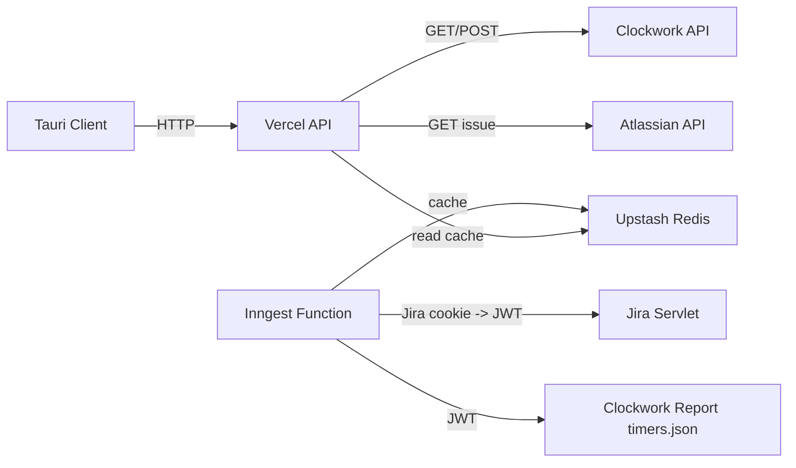

# Clockwork Menubar

Ứng dụng menu bar / system tray đa nền tảng (Tauri + React) để theo dõi và điều khiển Clockwork Pro timer cho Jira.

## 1. Mô tả hệ thống

Clockwork Menubar gồm 3 phần chính trong monorepo:

- `apps/tauri`: Desktop client (Tauri v2 + React + Vite)
- `apps/api`: Vercel API routes làm proxy tới Clockwork Pro API và Atlassian API
- `apps/inngest`: Inngest functions để crawl active timers và cache vào Redis

Luồng dữ liệu active timer:

1. Inngest nhận event sync (`clockwork/timers.sync.requested`)
2. Inngest exchange Jira cookie -> Clockwork JWT
3. Inngest gọi Clockwork Report API (`timers.json`)¨¨¨
4. Inngest cache kết quả vào Upstash Redis
5. Tauri client gọi `GET /api/timers/active` để lấy dữ liệu cache



## 2. Cấu trúc thư mục

```text
.
├── apps
│   ├── api              # Vercel API routes
│   ├── inngest          # Inngest background functions
│   └── tauri            # Tauri desktop app (React frontend + Rust backend)
├── packages
│   ├── eslint-config    # Shared ESLint config
│   └── typescript-config# Shared TS config
├── conductor            # Product/tracks/spec docs
└── docs
    └── deployment.md    # Deployment guide chi tiết
```

## 3. Tech stack

- Monorepo: Turborepo + pnpm workspace
- Frontend desktop: React 18, Vite, Tailwind CSS, TanStack Query
- Desktop runtime: Tauri v2 (Rust)
- Backend API: Vercel Functions (`@vercel/node`)
- Background jobs: Inngest
- Cache: Upstash Redis

## 4. Yêu cầu môi trường

- Node.js `>= 20`
- pnpm `>= 9`
- Rust toolchain (`rustup`, `cargo`) cho Tauri
- Tauri system dependencies:
  - macOS: Xcode Command Line Tools
  - Linux: theo hướng dẫn Tauri v2 (webkit2gtk, libayatana-appindicator, ...)
  - Windows: MSVC Build Tools + WebView2

Lưu ý: repo yêu cầu pnpm 9. Nếu máy đang pnpm cũ, dùng `corepack`:

```bash
corepack enable
corepack pnpm -v
```

## 5. Cài đặt nhanh

```bash
corepack pnpm install
```

## 6. Cấu hình biến môi trường

### 6.1 API app (`apps/api/.env`)

Copy từ `apps/api/.env.example`:

```bash
cp apps/api/.env.example apps/api/.env
```

Biến bắt buộc:

- `UPSTASH_REDIS_REST_URL`
- `UPSTASH_REDIS_REST_TOKEN`
- `CLOCKWORK_API_BASE_URL` (mặc định `https://api.clockwork.report/v1`)
- `CLOCKWORK_API_TOKEN`
- `ATLASSIAN_EMAIL`
- `ATLASSIAN_API_TOKEN`
- `JIRA_DOMAIN`

### 6.2 Inngest app (`apps/inngest/.env`)

Copy từ `apps/inngest/.env.example`:

```bash
cp apps/inngest/.env.example apps/inngest/.env
```

Biến bắt buộc:

- `UPSTASH_REDIS_REST_URL`
- `UPSTASH_REDIS_REST_TOKEN`
- `JIRA_FULL_COOKIE`
- `JIRA_DOMAIN`
- `INNGEST_EVENT_KEY`
- `INNGEST_SIGNING_KEY`

## 7. Chạy local

### 7.1 Chạy toàn bộ monorepo

```bash
corepack pnpm dev
```

### 7.2 Chạy từng app

API app (port 3000):

```bash
corepack pnpm --filter api dev
```

Inngest Express endpoint (port 3001):

```bash
corepack pnpm --filter inngest serve
```

Inngest dev server/dashboard:

```bash
corepack pnpm --filter inngest dev
```

Tauri frontend (chỉ Vite):

```bash
corepack pnpm --filter tauri dev
```

Tauri desktop app (Rust + WebView):

```bash
corepack pnpm --filter tauri tauri dev
```

## 8. Build và kiểm tra chất lượng

Lint:

```bash
corepack pnpm lint
```

Type-check toàn repo:

```bash
corepack pnpm turbo type-check
```

Build toàn repo:

```bash
corepack pnpm build
```

Build riêng Tauri frontend:

```bash
corepack pnpm --filter tauri build
```

## 9. Build và đóng gói Tauri

Chạy từ root:

```bash
corepack pnpm --filter tauri tauri build
```

Hoặc chạy trong app:

```bash
cd apps/tauri
corepack pnpm tauri build
```

Output bundle nằm trong thư mục `apps/tauri/src-tauri/target/release/bundle` (theo target OS).

### 9.1 Kiểm tra Rust layer

```bash
cd apps/tauri/src-tauri
cargo check
```

## 10. Cấu hình Tauri hiện tại

File chính: `apps/tauri/src-tauri/tauri.conf.json`

Thông số quan trọng:

- Window:
  - `width: 380`, `height: 560`
  - `decorations: false`
  - `alwaysOnTop: true`
  - `visible: false` (ẩn ban đầu)
- Tray icon:
  - `id: main`
  - `menuOnLeftClick: false`
  - click xử lý ở Rust (`apps/tauri/src-tauri/src/lib.rs`)
- Build hooks:
  - `beforeDevCommand: pnpm dev`
  - `beforeBuildCommand: pnpm build`

Rust runtime hiện có:

- Toggle show/hide popover khi click tray trái
- Position cửa sổ gần vị trí tray
- Hide on blur (non-debug)
- Lưu cấu hình local (`userEmail`, `apiBaseUrl`) qua Tauri commands

## 11. API endpoints chính

`apps/api` hiện cung cấp:

- `GET /api/health`
- `GET /api/timers/active?userEmail=...`
- `GET /api/worklogs?userEmail=...&date=YYYY-MM-DD`
- `POST /api/timers/start`
- `POST /api/timers/stop`
- `GET /api/issues/:key`

## 12. Triển khai (Vercel + Inngest)

Dự án deploy tách làm 2 Vercel project:

- Project 1: `apps/api`
- Project 2: `apps/inngest`

Hướng dẫn chi tiết có trong:

- `docs/deployment.md`

Tóm tắt:

1. `cd apps/api && vercel link`
2. set env vars cho API project
3. `vercel --prod`
4. lặp lại cho `apps/inngest`
5. đăng ký endpoint Inngest: `https://<inngest-url>/api/inngest`

## 13. Troubleshooting nhanh

### Lỗi pnpm version

Triệu chứng: `Unsupported environment ... Expected pnpm >=9`

Cách xử lý:

```bash
corepack enable
corepack pnpm -v
corepack pnpm install
```

### Không build được Tauri

- Kiểm tra đã cài Rust (`cargo --version`)
- Kiểm tra Tauri system dependencies theo OS
- Chạy `cargo check` trong `apps/tauri/src-tauri`

### API trả lỗi 500

- Kiểm tra file `.env` của `apps/api`
- Kiểm tra Redis credentials / Jira token / Clockwork token
- Kiểm tra logs từ `vercel dev`

## 14. Lưu ý bảo mật

- Không commit file `.env`
- `JIRA_FULL_COOKIE` là dữ liệu nhạy cảm, chỉ dùng trong môi trường private
- Nên rotate token định kỳ (Clockwork, Atlassian, Inngest, Upstash)

---

Nếu bạn muốn, có thể tách README này thành:

- `README.md` (quick start)
- `docs/architecture.md`
- `docs/tauri.md`
- `docs/backend.md`

để dễ maintain khi project lớn dần.
